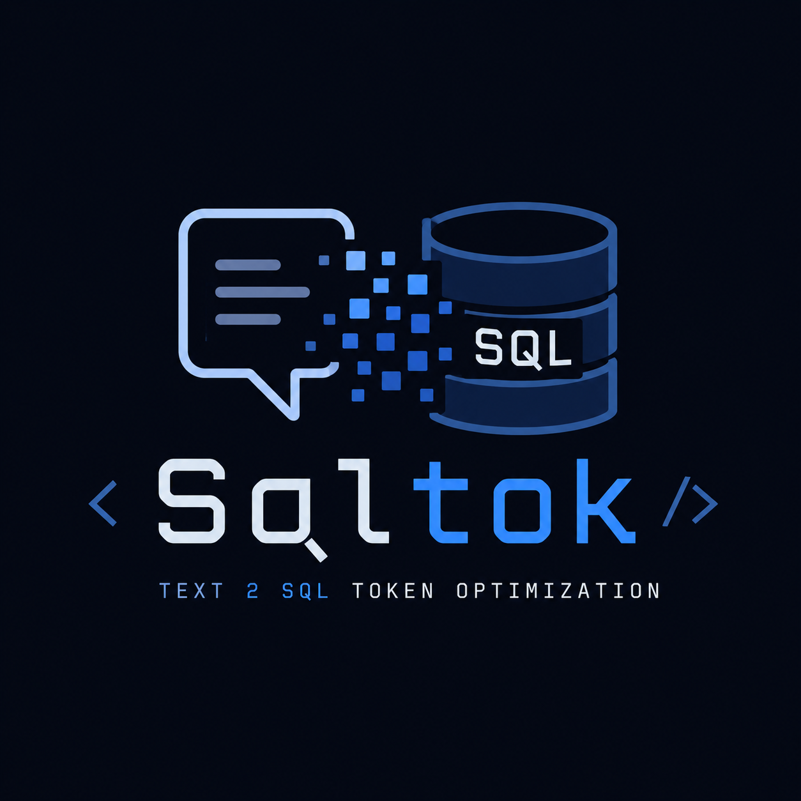

<div align="center">



<h1>SQLTok</h1>

<p><b>A schema token budget manager for Text-to-SQL.</b> Given a database and a question, SQLTok selects only the relevant tables and columns within a hard token budget and returns a compact schema string for the prompt.</p>

[](https://www.python.org/)
[](LICENSE)
[](https://github.com/ShovalBenjer/sqltok/actions/workflows/ci.yml)
[](https://github.com/astral-sh/ruff)
[](https://mypy-lang.org/)

</div>

Topics: Text-to-SQL, NL2SQL, LLM token optimization, prompt compression, schema linking, schema retrieval, BIRD benchmark, tiktoken, submodular optimization, MinHash, LSH.

## Contents

1. [Overview](#overview)
2. [Why SQLTok](#why-sqltok)
3. [Installation](#installation)
4. [Quickstart](#quickstart)
5. [How it works](#how-it-works)
6. [Architecture](#architecture)
7. [Benchmark](#benchmark)
8. [API](#api)
9. [Roadmap](#roadmap)
10. [References](#references)
11. [Citation](#citation)
12. [Contributing](#contributing)
13. [Glossary](#glossary)
14. [License](#license)

## Overview

When a large language model writes SQL from natural language, it needs the database schema in the prompt. Sending the entire schema on every request is the dominant hidden cost of production Text-to-SQL. A warehouse with thousands of tables routinely produces prompts of fifty thousand tokens or more, which are expensive, slow, and less accurate, because the model has to find the few relevant tables among many.

SQLTok is a Python library that addresses this directly. For each question it selects only the relevant tables and columns within a configurable token budget, and emits a compact `CREATE TABLE` style schema string. Token counts are measured with `tiktoken` rather than estimated, and the selected tables are guaranteed to be connected by foreign keys, so the model can write valid joins.

```python
from sqltok import SchemaBudgetManager

mgr = SchemaBudgetManager.from_sqlite("northwind.sqlite")
ctx = mgr.build_context("total order amount for customers in France", token_budget=2000)

print(ctx.text)          # compact CREATE TABLE schema, at most 2000 tokens
print(ctx.tables)        # ['customers', 'orders']
print(ctx.token_count)   # measured, guaranteed at or below the budget
```

Measured result: across all 500 BIRD mini-dev questions, at a 2000-token budget SQLTok keeps every gold-query table on 97 percent of questions while cutting total prompt input by 17 percent, deterministically and with no model required. At a tighter 1000-token budget it cuts total input by 36 percent at 92 percent full table recall. See [Benchmark](#benchmark).

This release (v0.1) provides the schema token budget manager and a BIRD benchmark harness. The semantic cache, intent canonicalizer, and framework integrations are described in the [roadmap](#roadmap) and are not part of this release.

## Why SQLTok

Most schema retrieval is top-k keyword matching. That approach fails in three ways that SQLTok is designed to handle.

| Limitation of keyword retrieval | How SQLTok handles it |
| --- | --- |
| Mentions hide in cell values. "France" is a value in `customers.country`, never a column name, so keyword search over names misses it. | Native value grounding with MinHash and LSH over sampled cell values. |
| Top-k ignores the budget and redundancy. It can exceed the token ceiling or select several tables covering the same content. | Submodular coverage under a hard token budget, where diminishing returns remove redundancy and yield a `(1 - 1/e)` guarantee. |
| Retrieved tables may not be joinable. Two relevant tables with no foreign-key path lead the model to invent joins. | Foreign-key Steiner connectivity adds the minimal set of bridge tables. |

BM25 is retained as the baseline selector (`RelevanceGreedySelector`) so that benchmark gains are attributable. The default selector is the value-grounded submodular algorithm described in [How it works](#how-it-works). The core library is implemented in Python and NumPy, is deterministic, and performs no network calls.

## Installation

```bash
pip install sqltok
```

The core dependencies are `tiktoken`, `bm25s`, `sqlglot`, and `numpy`. Optional extras are `sqltok[embeddings]`, `sqltok[benchmark]` for the Anthropic and OpenAI clients, and `sqltok[dev]` for the test and lint tooling.

## Quickstart

```python
from sqltok import SchemaBudgetManager

# Build from a live SQLite database. This introspects tables, foreign keys,
# and samples cell values. Alternatively use SchemaBudgetManager.from_ddl(sql).
mgr = SchemaBudgetManager.from_sqlite("path/to/db.sqlite")

ctx = mgr.build_context(
    question="What was the total order amount for customers in France?",
    token_budget=2000,          # hard ceiling on schema-context tokens
    include_sample_rows=True,   # one example row per included table
)

prompt = f"""Database schema:
{ctx.text}

Question: What was the total order amount for customers in France?
SQLite query:"""

print(ctx.tables)         # ['customers', 'orders']
print(ctx.token_count)    # measured with tiktoken, at or below the budget
print(ctx.bridge_tables)  # foreign-key bridges added to keep the schema joinable
print(ctx.covered_weight) # fraction of grounded question mentions covered
```

To use the BM25 baseline selector explicitly:

```python
from sqltok import SchemaBudgetManager, RelevanceGreedySelector
from sqltok.introspect import introspect_sqlite

schema = introspect_sqlite("db.sqlite")
mgr = SchemaBudgetManager(schema, selector=RelevanceGreedySelector(schema))
```

## How it works

SQLTok turns a schema, a question, and a budget into a budgeted, joinable schema string in four stages. For a longer, illustrated walkthrough with the full math, see the [visual guide](docs/blog/visual-guide-to-sqltok.md).

<p align="center"></p>

### Stage 1: value grounding

The goal is a matrix `cover[table, mention]` in the range zero to one, plus a weight for each mention.

1. Mention extraction (`grounding/text.py`). The question is split into candidate phrases: one to three word n-grams plus quoted literals, with stopwords trimmed from the edges. For example, "total revenue by region" yields "total revenue", "revenue", and "region".

2. Character shingling. Each string becomes a set of three-character substrings. "France" becomes the set {fra, ran, anc, nce}. Character shingles give fuzzy matching that is robust to plurals, casing, and small typos, so "widgets" and "widget" share most of their shingles.

3. MinHash (`grounding/minhash.py`). Each shingle set is reduced to a signature of length 64. The defining property is that the probability that two sets share the same minimum hash in a given position equals their Jaccard similarity:

   ```
   P(min h_i(A) = min h_i(B)) = |A intersect B| / |A union B| = Jaccard(A, B)
   ```

   Therefore the fraction of equal signature positions is an unbiased estimate of the Jaccard similarity, computed by comparing two vectors of 64 integers instead of two raw sets. Fixed seeds make this deterministic.

4. Banded LSH (`grounding/lsh.py`). Every schema string, meaning table names, column names, and sampled cell values, is indexed by its signature, split into 32 bands of 2 rows. Items that match across a full band fall into the same bucket, and a query inspects only colliding buckets. This produces candidates in near constant time rather than scanning every value. The collision threshold is approximately `(1 / bands) ** (1 / rows)`, about 0.18, which favors recall. This is the value-grounding idea from CHESS, implemented natively.

5. Affinity and self-supervised IDF (`grounding/affinity.py`). For each mention, the best estimated Jaccard match per table becomes an entry of `cover`. Each mention is then weighted by an inverse document frequency learned from the schema itself:

   ```
   weight(m) = log(1 + num_tables / df(m))
   ```

   where `df(m)` is the number of tables the mention touches. A mention that hits every table, such as `id` or `name`, carries close to zero weight, while a mention that hits a single table is highly discriminative. The signal comes from the database, not from a generic English corpus.

The motivating case is "widgets", a value in `products.category` that appears in no column name. Name-based BM25 cannot see it, while the LSH over values grounds it to `products` with high affinity.

### Stage 2: submodular budgeting

The objective (`select/coverage.py`) is weighted maximum coverage:

```
f(S) = sum over mentions m of  weight(m) * max over tables T in S of cover(m, T)
```

Each mention scores through the single best table that covers it. The use of `max` gives diminishing returns: once a mention is covered, another table that covers it adds zero marginal value, so redundancy is handled automatically and `f` is monotone and submodular. For such functions, the greedy maximizer has the classic `(1 - 1/e)`, about 0.63, approximation guarantee, which is a bound rather than a heuristic.

Tables have different token costs, so the selection is a knapsack. At each step SQLTok picks the table that maximizes marginal gain divided by token cost, which is the token-budgeted, redundancy-aware rule from AdaGReS, and commits it only if the re-measured context still fits the budget. Because marginal gains only decrease as tables are added, a CELF lazy evaluation keeps a priority queue and recomputes a candidate only when it reaches the top, which reduces hundreds of evaluations to a few and is the part that scales to wide schemas. Ratio-greedy can be misled by a single large high-value table, so SQLTok also compares against the best single table that fits, following Khuller, Moss, and Naor, and keeps whichever covers more. If nothing grounds, it packs the smallest tables first so the output is never empty and is always within budget.

### Stage 3: foreign-key Steiner connectivity

A relevance-only set can contain `products` and `orders` with no direct join, which leads the model to invent an incorrect join. SQLTok (`select/connect.py`) builds the undirected foreign-key graph, checks whether the selected tables form one connected component, and if not finds the shortest foreign-key path between components and adds the minimal bridge tables, for example `line_items` connecting `products` and `orders`, as long as the budget allows. This is a heuristic Steiner tree over the foreign-key graph, following the AutoLink observation that foreign keys are the natural bridges between relevant tables. The result is a sub-schema that is not only relevant but executably joinable.

### Stage 4: the budget guarantee

Every tentative add (`select/base.py`, `BudgetPacker.try_add`) renders the full context and counts it with `tiktoken`, committing a table only if the total stays within budget, and falling back to dropping the sample row before dropping the table. Because the actual string is measured at every step, `token_count` at or below `token_budget` is an invariant that no selection logic can break.

## Architecture

```
sqltok/
  models.py          Schema, Table, Column, ForeignKey, and compact DDL rendering
  tokenizer.py       tiktoken wrapper for real token counts
  ddl.py             sqlglot CREATE TABLE parser
  introspect.py      SQLite introspection and cell-value sampling
  grounding/         Stage 1: native value grounding
    text.py          mention extraction and character shingles
    minhash.py       MinHash for Jaccard estimation
    lsh.py           banded LSH for candidate generation
    affinity.py      cover matrix and self-supervised IDF
  select/            Stages 2 to 4: selection strategies
    base.py          SchemaSelector protocol and BudgetPacker
    coverage.py      CoverageSelector, the default submodular CELF greedy
    connect.py       foreign-key Steiner connectivity
    greedy.py        RelevanceGreedySelector, the BM25 baseline
    stubs.py         rerank and agentic selectors for v0.2
  manager.py         SchemaBudgetManager, the public API
  context.py         SchemaContext, the result type
```

## Benchmark

The harness in [`benchmarks/`](benchmarks/) runs two arms with the same model and the same prompt template, differing only in the schema context: a baseline that sends the full schema dump, and SQLTok at budgets of 1000, 2000, and 4000 tokens. Execution accuracy is scored by the official BIRD script rather than a custom checker.

The tables below cover all 500 BIRD mini-dev questions over 11 databases, measured with `tiktoken` (`cl100k_base`). Both are deterministic and require no model. The baseline is the full schema dump with one sample row per table.

Schema-linking recall (does SQLTok keep the tables the gold query needs). Full-recall is the rate at which every gold table is present, which is the ceiling on achievable execution accuracy.

| budget | table recall | full-recall rate | precision | avg tables |
| ---: | ---: | ---: | ---: | ---: |
| 1000 | 96.3% | 91.8% | 42.8% | 5.45 |
| 2000 | 99.0% | 97.4% | 40.7% | 6.11 |
| 4000 | 99.0% | 97.4% | 39.8% | 6.24 |

Token reduction vs the full-dump baseline.

| arm | schema tokens (mean) | total input tokens | total input reduction | execution accuracy |
| --- | ---: | ---: | ---: | ---: |
| baseline (full dump) | 1161 | 629,819 | reference | run pending |
| sqltok at 1000 | 703 | 401,285 | 36.3% | run pending |
| sqltok at 2000 | 944 | 521,760 | 17.2% | run pending |
| sqltok at 4000 | 1064 | 581,559 | 7.7% | run pending |

Two honest notes. The token reduction looks modest because BIRD schemas are small (the full dump averages 1161 tokens); the savings grow with schema size, while recall is the size-independent correctness metric. Precision is near 40 percent because FK-neighbour expansion deliberately spends spare budget on likely join targets to lift full-recall; set `CoverageSelector(schema, fk_min_links=2)` to trade recall for tokens. Execution accuracy is filled in from a keyed run with the official BIRD script. See [`benchmarks/RESULTS.md`](benchmarks/RESULTS.md).

Reproduce with a free run that needs no API keys, using the mock client:

```bash
python benchmarks/make_sample_data.py
python benchmarks/run_bird.py --provider mock --data-dir benchmarks/sample_data --limit 5
```

Run execution accuracy on BIRD mini-dev with no API key, using a local model through Ollama:

```bash
bash benchmarks/download.sh
ollama pull qwen2.5-coder:7b
python benchmarks/run_bird.py --provider ollama --model qwen2.5-coder:7b \
    --questions benchmarks/data/minidev/MINIDEV/mini_dev_sqlite.json \
    --db-root  benchmarks/data/minidev/MINIDEV/dev_databases --budgets 1000 2000 4000
```

Hosted providers are optional (`--provider anthropic` or `--provider openai`, reading the usual env keys). Responses are cached on disk, keyed by a hash of prompt and model, so reruns are free and resumable.

## API

| Symbol | Purpose |
| --- | --- |
| `SchemaBudgetManager.from_sqlite(path)`, `.from_ddl(sql)` | Build a manager from a database or from DDL. |
| `mgr.build_context(question, token_budget, include_sample_rows, fk_expand)` | Return a `SchemaContext`. |
| `SchemaContext.text`, `.tables`, `.token_count`, `.bridge_tables`, `.covered_weight` | Result fields. |
| `CoverageSelector` | The default value-grounded submodular selector. |
| `RelevanceGreedySelector` | The BM25 baseline and ablation. |
| `SchemaGrounding` | Standalone grounding that returns the cover matrix and weights. |
| `SchemaSelector` | The protocol to implement a custom strategy. |

## Roadmap

The following items are planned, drawn from the research these ideas build on.

1. SID semantic cache. Canonicalize natural language and SQL into a hashable SQL Intent Descriptor, with exact and derivation (roll-up and filter-down) cache hits.
2. Intent canonicalizer. Convert a SQL AST to a SID with `sqlglot`, and convert natural language to a SID with confidence gating.
3. Invalidation tag registry. Provide and invalidate cache entries by table lineage, in the style of RTK Query.
4. Cache backends. Add Redis and DuckDB, and align the KV prefix for provider prompt caches.
5. Additional selectors. A cross-encoder rerank selector and an LLM agentic selector in the style of Datalake Agent and AutoLink, plus embedding hybrid retrieval.
6. Integrations. Adapters for LangChain, LlamaIndex, and Vanna.

## References

SQLTok packages and combines techniques from recent work. If you build on it, please credit these sources.

Foundations of the library:

1. Datalake Agent. Agentic NL2SQL to Reduce Computational Costs. arXiv [2510.14808][1]. Budget-aware lazy schema discovery, up to 87 percent token reduction.
2. OLAP Intent Signature, LLMSigCache. Semantic Caching for OLAP via LLM-Based Query Canonicalization, DOLAP 2026. arXiv [2602.19811][2]. The intent-signature cache that the v0.2 SID layer generalizes.
3. AgentSM. Semantic Memory for Agentic Text-to-SQL. arXiv [2601.15709][3]. Reasoning-path reuse for the v0.2 memory and derivations roadmap.

Sources that inform the default selector:

4. Bidirectional Schema Linking. Findings of EACL 2026. arXiv [2510.14296][4]. Schema linking as a first-class retrieval problem.
5. AutoLink. Autonomous Schema Exploration and Expansion at Scale. arXiv [2511.17190][5]. Foreign keys as natural bridges, which motivates Steiner connectivity.
6. AdaGReS. Adaptive Greedy Context Selection via Redundancy-Aware Scoring for Token-Budgeted RAG. arXiv [2512.25052][6]. The token-budgeted greedy rule.
7. Sub-SA. Submodular Selective Annotation. arXiv [2407.05693][7]. Submodular reward and diversity selection.
8. CHESS. Contextual Harnessing for Efficient SQL Synthesis. arXiv [2405.16755][8]. LSH value grounding.

Classical results behind the mathematics: Broder, On the resemblance and containment of documents, 1997 (MinHash); Indyk and Motwani, 1998 (LSH); Nemhauser, Wolsey, and Fisher, 1978 (the `(1 - 1/e)` bound); Khuller, Moss, and Naor, 1999 (budgeted maximum coverage); Leskovec et al., Cost-effective Outbreak Detection, 2007 (CELF).

## Citation

```bibtex
@software{sqltok2026,
  title   = {SQLTok: A Schema Token Budget Manager for Text-to-SQL},
  author  = {Benjer, Shoval and contributors},
  year    = {2026},
  url     = {https://github.com/ShovalBenjer/sqltok},
  note    = {Value-grounded submodular schema selection under a token budget}
}
```

## Contributing

Issues and pull requests are welcome.

```bash
git clone https://github.com/ShovalBenjer/sqltok && cd sqltok
pip install -e ".[dev]"
python -m pytest          # tests require no API keys
ruff check . && mypy sqltok/
```

## Glossary

| Term | Meaning |
| --- | --- |
| Text-to-SQL, NL2SQL | Translating a natural-language question into an executable SQL query. |
| Schema linking | Mapping words in a question to the relevant tables and columns of a database. |
| Schema context | The slice of schema placed in the prompt. SQLTok minimizes this. |
| Token budget | A hard upper bound on how many tokens the schema context may use. |
| tiktoken | The OpenAI BPE tokenizer, used here to count tokens exactly (`cl100k_base` by default). |
| Mention | A candidate phrase extracted from the question, an n-gram or a quoted literal. |
| Grounding | Linking a mention to schema elements, including cell values and not only names. |
| Shingle | A fixed-length substring, three characters here, used to compare strings fuzzily. |
| Jaccard similarity | The set overlap, the size of the intersection divided by the size of the union. |
| MinHash | A sketch that estimates Jaccard by comparing fixed-length signatures. |
| LSH | Locality-sensitive hashing, which places similar items in the same bucket for fast lookup. |
| Band and row | The signature is split into bands of rows, and a full-band match marks a candidate. |
| Self-supervised IDF | Down-weights mentions that match many tables, computed from your schema. |
| Coverage function | f(S) equals the sum of weight times max cover, the question weight a table set explains. |
| Submodular | Diminishing returns, where adding an element helps less as the set grows. |
| Monotone | Adding elements never decreases the objective. |
| (1 - 1/e) guarantee | Greedy reaches at least about 63 percent of the optimum for monotone submodular maximization. |
| Knapsack constraint | Selection under a budget where items have unequal costs, here tokens. |
| Cost-benefit greedy | Selecting by marginal gain divided by cost, the budgeted greedy rule. |
| CELF | Cost-effective lazy forward selection, a lazy greedy that exploits submodularity. |
| Foreign-key graph | Tables as nodes and foreign keys as edges. |
| Steiner tree | A minimal connected subgraph that spans a target set, possibly through extra nodes. |
| Bridge table | An intermediate table added so that selected tables become joinable. |
| Selector | A pluggable strategy that turns a question into a schema context. |
| BIRD | A large, realistic Text-to-SQL benchmark. The mini-dev split has 500 questions. |
| Execution accuracy | Correctness measured by comparing executed result sets, not SQL strings. |

## License

MIT. See [LICENSE](LICENSE).

[1]: https://arxiv.org/abs/2510.14808
[2]: https://arxiv.org/abs/2602.19811
[3]: https://arxiv.org/abs/2601.15709
[4]: https://arxiv.org/abs/2510.14296
[5]: https://arxiv.org/abs/2511.17190
[6]: https://arxiv.org/abs/2512.25052
[7]: https://arxiv.org/abs/2407.05693
[8]: https://arxiv.org/abs/2405.16755
