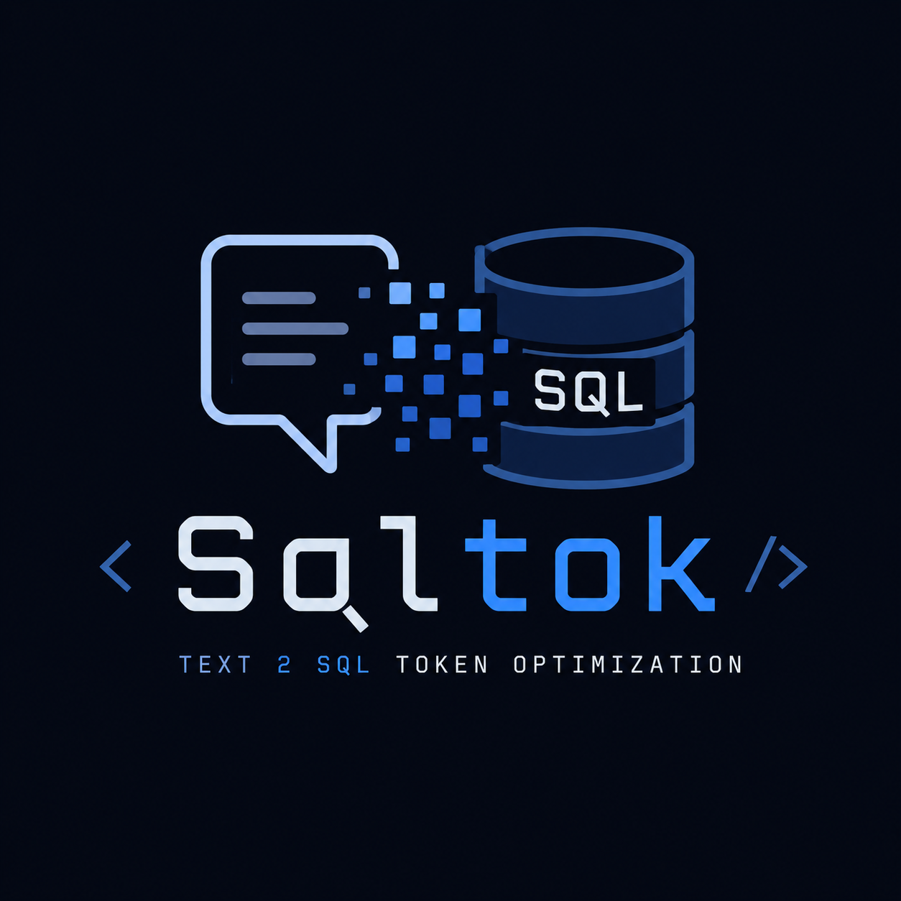

<div align="center">



<h1>SQLTok</h1>

<p><b>A schema token budget manager for Text-to-SQL.</b> Given a database and a question, SQLTok selects only the relevant tables and columns within a hard token budget and returns a compact schema string for the prompt.</p>

<p>On BIRD mini-dev (500 questions): keeps <b>97%</b> of gold-query tables at a 2,000-token budget and cuts prompt input <b>36%</b> at 1,000 tokens, benchmarked against BM25. Details in <a href="benchmarks/RESULTS.md">benchmarks/RESULTS.md</a>.</p>

[](https://www.python.org/)
[](LICENSE)
[](https://github.com/ShovalBenjer/sqltok/actions/workflows/ci.yml)
[](https://github.com/astral-sh/ruff)
[](https://mypy-lang.org/)

</div>

Topics: Text-to-SQL, NL2SQL, LLM token optimization, prompt compression, schema linking, schema retrieval, BIRD benchmark, tiktoken, submodular optimization, MinHash, LSH.

## Contents

1. [Overview](#overview)
2. [Why SQLTok](#why-sqltok)
3. [Installation](#installation)
4. [Quickstart](#quickstart)
5. [How it works](#how-it-works)
6. [Architecture](#architecture)
7. [Benchmark](#benchmark)
8. [API](#api)
9. [Roadmap](#roadmap)
10. [References](#references)
11. [Citation](#citation)
12. [Contributing](#contributing)
13. [Glossary](#glossary)
14. [License](#license)
## Installation

```bash
pip install sqltok
```

Optional extras:

```bash
pip install sqltok[embeddings]   # sentence-transformers for dense retrieval
pip install sqltok[benchmark]    # anthropic, openai clients for live LLM runs
pip install sqltok[dev]          # pytest, hypothesis, ruff, mypy for contributors
```

## Quickstart

```python
from sqltok import SchemaBudgetManager

mgr = SchemaBudgetManager.from_sqlite("path/to/db.sqlite")
ctx = mgr.build_context(
    question="What was the total order amount for customers in France?",
ctx = mgr.build_context(
    question="What was the total order amount for customers in France?",
    token_budget=2000,  # hard ceiling on schema-context tokens
    include_sample_rows=True,  # one example row per included table
)

prompt = f"""Database schema:
{ctx.text}

Question: What was the total order amount for customers in France?
SQLite query:"""

print(ctx.tables)  # ['customers', 'orders']
print(ctx.token_count)  # measured with tiktoken, at or below the budget
print(ctx.bridge_tables)  # foreign-key bridges added to keep the schema joinable
print(ctx.covered_weight)  # fraction of grounded question mentions covered
```

## Features

- **Value grounding**: MinHash + banded LSH over table names, column names, and sampled cell values. Finds mentions that keyword search misses, like "France" in `customers.country`.
- **Submodular budgeting**: Weighted maximum coverage with CELF lazy evaluation, giving a `(1 - 1/e)` approximation guarantee and automatic redundancy removal.
- **FK Steiner connectivity**: Adds the minimal set of bridge tables so the selection is join-connected, preventing hallucinated joins.
- **Hard token budget**: Every candidate is rendered and counted with `tiktoken` before committing. `token_count <= token_budget` is an invariant.
- **Deterministic**: Fixed seeds, no network calls, no model required for selection.
- **Framework-agnostic output**: A plain `CREATE TABLE`-style string that works with every LLM, every framework, and every prompt template.

## How it works

SQLTok turns a schema, a question, and a budget into a budgeted, joinable schema string in four stages. For a longer, illustrated walkthrough with the full math, see the [visual guide](site/posts/visual-guide-to-sqltok/).

1. **Value grounding**: Extract mentions from the question, ground them to tables
   via MinHash + LSH over names and sampled cell values, weight mentions by
   self-supervised IDF.
2. **Submodular budgeting**: Greedily select tables maximizing weighted coverage
   per token, with CELF lazy evaluation and a best-single-table fallback.
3. **FK Steiner connectivity**: Add bridge tables so the selection is
   join-connected.
4. **Budget guarantee**: Re-measure with `tiktoken` at every step; drop sample
   rows before dropping tables.

For a longer, illustrated walkthrough, see the [visual guide](docs/blog/visual-guide-to-sqltok.md).
The canonical Mermaid diagrams are in [`docs/diagrams/`](docs/diagrams/).

The goal is a matrix `cover[table, mention]` in the range zero to one, plus a weight for each mention. Candidate phrases are extracted from the question, turned into character shingles, compressed with MinHash, and looked up in a banded LSH index over table names, column names, and sampled cell values. Each mention is then weighted by an inverse document frequency learned from the schema itself, so that rare, discriminative mentions count more than generic ones like `id`.

### Stage 2: submodular budgeting

The objective (`select/coverage.py`) is weighted maximum coverage: each mention scores through the single best table that covers it. The `max` gives diminishing returns, so `f` is monotone and submodular, and greedy maximization carries a `(1 - 1/e)` approximation guarantee. Tables have different token costs, so selection is a knapsack: SQLTok picks the table with the largest marginal gain divided by token cost, commits it only if the re-measured context still fits the budget, and uses CELF lazy evaluation to avoid recomputing every candidate at every step.

### Stage 3: foreign-key Steiner connectivity

A relevance-only set can contain two tables with no direct join. SQLTok (`select/connect.py`) builds the undirected foreign-key graph, checks whether the selected tables form one connected component, and if not adds the minimal bridge tables along the shortest foreign-key path, as long as the budget allows.

### Stage 4: the budget guarantee

Every tentative add (`select/base.py`, `BudgetPacker.try_add`) renders the full context and counts it with `tiktoken`, committing a table only if the total stays within budget, and falling back to dropping the sample row before dropping the table. Because the actual string is measured at every step, `token_count` at or below `token_budget` is an invariant that no selection logic can break.

## Architecture

```
sqltok/
  models.py          Schema, Table, Column, ForeignKey, and compact DDL rendering
  tokenizer.py       tiktoken wrapper for real token counts
  ddl.py             sqlglot CREATE TABLE parser
  introspect.py      SQLite introspection and cell-value sampling
  grounding/         Stage 1: native value grounding
    text.py          mention extraction and character shingles
    minhash.py       MinHash for Jaccard estimation
    lsh.py           banded LSH for candidate generation
    affinity.py      cover matrix and self-supervised IDF
  select/            Stages 2 to 4: selection strategies
    base.py          SchemaSelector protocol and BudgetPacker
    coverage.py      CoverageSelector, the default submodular CELF greedy
    connect.py       foreign-key Steiner connectivity
    greedy.py        RelevanceGreedySelector, the BM25 baseline
    stubs.py         rerank and agentic selectors for v0.2
  manager.py         SchemaBudgetManager, the public API
  context.py         SchemaContext, the result type
```

## Benchmark

The harness in [`benchmarks/`](benchmarks/) runs two arms with the same model and the same prompt template, differing only in the schema context: a baseline that sends the full schema dump, and SQLTok at budgets of 1000, 2000, and 4000 tokens. Execution accuracy is scored by the official BIRD script rather than a custom checker.

The tables below cover all 500 BIRD mini-dev questions over 11 databases, measured with `tiktoken` (`cl100k_base`). Both are deterministic and require no model. The baseline is the full schema dump with one sample row per table.

Schema-linking recall (does SQLTok keep the tables the gold query needs). Full-recall is the rate at which every gold table is present, which is the ceiling on achievable execution accuracy.

| budget | table recall | full-recall rate | precision | avg tables |
| ---: | ---: | ---: | ---: | ---: |
| 1000 | 96.3% | 91.8% | 42.8% | 5.45 |
| 2000 | 99.0% | 97.4% | 40.7% | 6.11 |
| 4000 | 99.0% | 97.4% | 39.8% | 6.24 |

### Token reduction

| arm | schema tokens (mean) | total input tokens | total input reduction |
| --- | ---: | ---: | ---: |
| baseline (full dump) | 1161 | 629,819 | reference |
| sqltok at 1000 | 703 | 401,285 | 36.3% |
| sqltok at 2000 | 944 | 521,760 | 17.2% |
| sqltok at 4000 | 1064 | 581,559 | 7.7% |

## Documentation

| Section | Purpose |
| --- | --- |
| [docs/GETTING-STARTED.md](docs/GETTING-STARTED.md) | Installation, first query, common patterns, troubleshooting, real-world SQLite examples. |
| [docs/API.md](docs/API.md) | Full reference for every public class, method, parameter, and data type. |
| [docs/DESIGN.md](docs/DESIGN.md) | Why SQLTok exists, design decisions with alternatives, performance, and the Rust migration path. |
| [docs/blog/visual-guide-to-sqltok.md](docs/blog/visual-guide-to-sqltok.md) | Illustrated walkthrough of the pipeline. |
| [benchmarks/README.md](benchmarks/README.md) | How to run the benchmark harness. |
| [RUNBOOK.md](RUNBOOK.md) | Execution steps: benchmarking, PyPI publishing, docs site deployment, social posting. |

## Contributing

Issues and pull requests are welcome.

```bash
git clone https://github.com/ShovalBenjer/sqltok && cd sqltok
pip install -e ".[dev]"
python -m pytest
ruff check . && mypy sqltok/
```

See [`docs/README.md`](docs/README.md) for the documentation contribution guide.

## Roadmap

1. SID semantic cache for canonicalized query reuse.
2. Intent canonicalizer and invalidation tag registry.
3. Cache backends (Redis, DuckDB).
4. Additional selectors: cross-encoder rerank, LLM agentic discovery.
5. Integrations for LangChain, LlamaIndex, Vanna.
6. Rust core migration for speed and distribution (see [`docs/rust-rewrite-plan.md`](docs/rust-rewrite-plan.md)).

## License

MIT. See [LICENSE](LICENSE).
