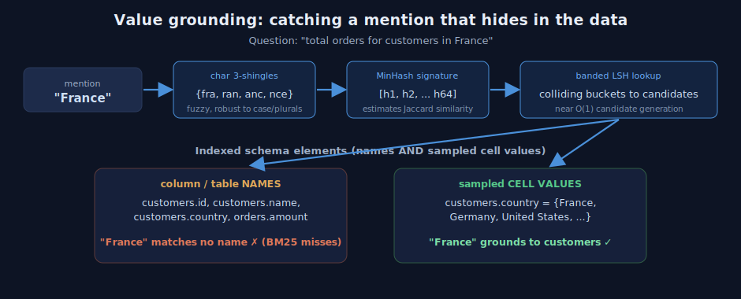
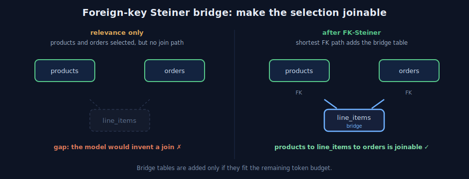

# A Visual Guide to SQLTok: Submodular Schema Selection for Text-to-SQL

When a language model writes SQL from a question, it needs to see the database schema. The simplest thing to do is paste the whole schema into the prompt. On a real warehouse that is also the most expensive thing to do, and it lowers accuracy, because the model has to find a few relevant tables inside thousands.

This post is a visual, step by step guide to how SQLTok solves that. It selects only the relevant tables and columns, keeps the result inside a token budget, and guarantees that the selected tables can actually be joined. Each idea is grounded in recent Text-to-SQL research, and everything is implemented natively in Python and NumPy. We will build intuition first and add the math after.

Measured up front: across all 500 BIRD mini-dev questions, at a 1000-token budget SQLTok cuts schema-context tokens by 57 percent and total prompt input by 53 percent. The number is deterministic and needs no model.

## The whole idea in one picture

SQLTok is a pipeline with three working stages and a guarantee.


The inputs are a question, a schema, and a token budget. Stage one decides which words in the question touch which tables. Stage two selects a set of tables that covers the most of the question per token, under the budget. Stage three repairs the selection so the tables can be joined. The output is a compact schema string whose token count is measured, not estimated, so it never exceeds the budget.

## Stage one: grounding, or which words touch which tables

Start with the failure mode of plain keyword search. Consider the question "total orders for customers in France." The word that matters most, "France," is not a table name and not a column name. It is a value sitting inside `customers.country`. Keyword search over schema names cannot see it.

SQLTok grounds mentions against the schema names and against sampled cell values.



Read the figure left to right. The mention "France" becomes a set of three-character pieces, called shingles: `{fra, ran, anc, nce}`. Shingles give fuzzy matching, so plurals, casing, and small typos still line up. Each shingle set is compressed into a short numeric signature with MinHash, and the signature is looked up in a banded LSH index that holds every table name, column name, and sampled value. "France" collides with the sampled values of `customers.country`, so it grounds to `customers`, even though no name mentions it.

### The math behind grounding

Three classical tools do the work.

Jaccard similarity measures the overlap of two sets:

```
Jaccard(A, B) = |A intersect B| / |A union B|
```

MinHash estimates that overlap cheaply. For a random hash permutation h, the probability that two sets share the same minimum equals their Jaccard similarity:

```
P( min h(A) = min h(B) ) = Jaccard(A, B)
```

With 64 independent permutations, the fraction of matching signature positions is an unbiased estimate of Jaccard, computed by comparing 64 integers instead of two raw sets.

LSH turns that estimate into fast lookup. The 64-position signature is split into b bands of r rows. Two items become candidates if they match on at least one full band. The probability that two items with similarity s collide is

```
P(collide) = 1 - (1 - s^r)^b
```

which is an S-shaped curve with a soft threshold near `(1 / b)^(1 / r)`. SQLTok uses 32 bands of 2 rows, a threshold near 0.18, which favors recall.

Finally, each grounded mention gets a weight from an inverse document frequency computed on the schema itself:

```
weight(m) = log(1 + num_tables / df(m))
```

where `df(m)` is the number of tables the mention touches. A mention that hits every table, like `id`, gets near zero weight. A mention that hits a single table is highly discriminative. The signal comes from your database, not a generic corpus.

The output of stage one is a matrix `cover[table, mention]` of affinities in the range zero to one, and a weight per mention.

## Stage two: coverage, or pick the best tables per token

Now we choose tables. The objective is weighted maximum coverage: each mention scores through the single best table that covers it.


The figure shows why this is the right shape. Once "amount" is covered by `orders`, a second table that also covers "amount," such as `orders_archive`, adds nothing. Its marginal gain is zero, so it is skipped. Redundancy is removed automatically, not by a special rule.

### The math behind coverage

The objective is

```
f(S) = sum over mentions m of  weight(m) * max over tables T in S of cover(m, T)
```

This function is monotone, adding a table never lowers it, and submodular, the gain of a table shrinks as the selection grows. For such functions a greedy maximizer reaches at least a `(1 - 1/e)` fraction, about 63 percent, of the best possible value. That is a guarantee, not a hope.

Tables have different token costs, so selection is a knapsack. SQLTok picks the table with the largest marginal gain divided by token cost, commits it only if the re-measured context still fits the budget, and uses CELF lazy evaluation to avoid recomputing every candidate at every step. Because gains only shrink, a candidate at the top of the queue with a current timestamp is provably the best next pick. SQLTok also compares against the best single table that fits, which restores the constant-factor guarantee for the budgeted case.

## Stage three: foreign-key Steiner connectivity

A set chosen purely for relevance can contain two tables with no join between them. The model then invents a join and produces wrong SQL.



SQLTok builds the foreign-key graph, checks whether the selected tables are connected, and if not adds the smallest set of bridge tables along the shortest foreign-key path, as long as they fit the budget. On the left, `products` and `orders` are both relevant but unlinked. On the right, `line_items` is added as a bridge, and now the schema is joinable. This follows the observation that foreign keys are the natural bridges between relevant tables.

## Stage four: the budget is a hard ceiling

Every time a table is considered, SQLTok renders the full context and counts it with the real tokenizer, committing the table only if the total stays within budget, and dropping the sample row before dropping the table. Because the actual string is measured at each step, the final token count at or below the budget is an invariant that no selection logic can break.

## Does it work

On all 500 BIRD mini-dev questions across 11 databases, measured with tiktoken:

| arm | schema tokens (mean) | total input tokens | reduction vs baseline |
| --- | ---: | ---: | ---: |
| baseline (full dump) | 1161 | 629,819 | reference |
| sqltok at 1000 | 497 | 298,234 | 57% schema, 53% total |
| sqltok at 2000 | 648 | 373,675 | 44% schema, 41% total |
| sqltok at 4000 | 752 | 425,687 | 35% schema, 32% total |

These token figures are deterministic. The remaining question, whether accuracy holds at the lower token count, is answered by running the official BIRD execution-accuracy script with a real model, which the repository supports directly.

## Formal summary

Let T be the tables and M the grounded mentions of a question. Let `cover` be a matrix in `[0,1]^{T x M}`, `w` a weight vector in `R_{>=0}^M`, `c(T)` the token cost of table T, and B the budget.

Define `f(S) = sum_m w_m * max_{T in S} cover[T, m]`.

Claim. f is monotone and submodular. Monotone, because adding a table can only raise an inner max. Submodular, because for `S subset of S'` the marginal `f(S + T) - f(S)` is at least `f(S' + T) - f(S')`, since the baseline `max` over S' is already at least the baseline over S.

Selection solves `max f(S)` subject to `sum_{T in S} c(T) <= B`. SQLTok applies the cost-benefit greedy, picking `argmax_T (f(S + T) - f(S)) / c(T)` among feasible tables, accelerated by CELF, and compares with the best single feasible table. For monotone submodular maximization, greedy achieves `f(S) >= (1 - 1/e) * f(S_opt)` under a cardinality relaxation, and the budgeted variant is handled by the single-element comparison.

Connectivity then augments S with a minimal set of bridge tables so that the induced subgraph of the foreign-key graph is connected, subject to the same budget, a heuristic Steiner tree.

## Try it

```bash
pip install sqltok
```

```python
from sqltok import SchemaBudgetManager

mgr = SchemaBudgetManager.from_sqlite("db.sqlite")
ctx = mgr.build_context("total orders for customers in France", token_budget=2000)
print(ctx.text, ctx.tables, ctx.token_count)
```

## References

1. Datalake Agent, Agentic NL2SQL to Reduce Computational Costs. arXiv 2510.14808.
2. Bidirectional Schema Linking, Findings of EACL 2026. arXiv 2510.14296.
3. AutoLink, Autonomous Schema Exploration and Expansion at Scale. arXiv 2511.17190.
4. AdaGReS, Adaptive Greedy Context Selection for Token-Budgeted RAG. arXiv 2512.25052.
5. Sub-SA, Submodular Selective Annotation. arXiv 2407.05693.
6. CHESS, Contextual Harnessing for Efficient SQL Synthesis. arXiv 2405.16755.
7. Nemhauser, Wolsey, and Fisher, the (1 - 1/e) bound for submodular maximization, 1978.
8. Broder, MinHash, 1997. Indyk and Motwani, LSH, 1998. Leskovec et al., CELF, 2007.
