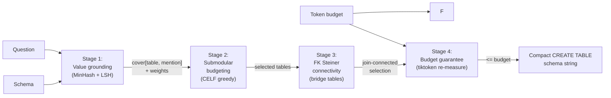
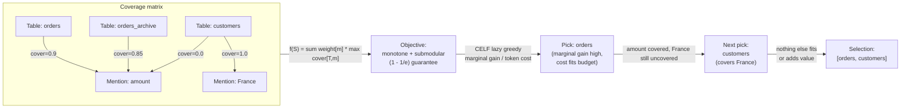
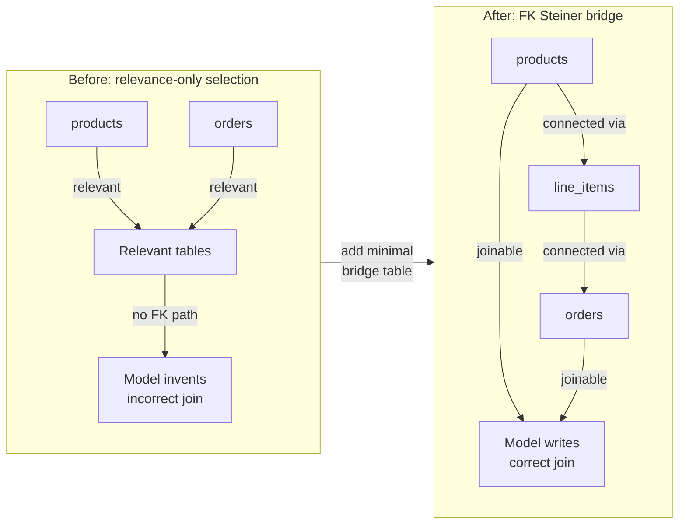

# A Visual Guide to SQLTok

This post is a visual, step-by-step guide to how SQLTok turns a question, a
schema, and a token budget into a compact, joinable schema string. Each idea is
grounded in recent Text-to-SQL research, and everything is implemented natively
in Python and NumPy.

Measured up front: across all 500 BIRD mini-dev questions, at a 2000-token
budget SQLTok keeps every table the gold query needs on 97 percent of questions
while cutting total prompt input by 17 percent. At a 1000-token budget it cuts
total input by 36 percent at 92 percent full table recall. The numbers are
deterministic and need no model.

## The canonical diagrams

The architecture diagrams below are the single source of truth. They are written
in Mermaid and are also used by the documentation site.

### The whole pipeline


```mermaid
flowchart LR
    A["Question"] --> B["Stage 1:\nValue grounding\n(MinHash + LSH)"]
    C["Schema"] --> B
    D["Token budget"] --> F

    B -->|"cover[table, mention]\n+ weights"| E["Stage 2:\nSubmodular\nbudgeting\n(CELF greedy)"]
    E -->|"selected tables"| G["Stage 3:\nFK Steiner\nconnectivity\n(bridge tables)"]
    G -->|"join-connected\nselection"| H["Stage 4:\nBudget guarantee\n(tiktoken re-measure)"]
    D --> H

    H -->|"<= budget"| I["Compact CREATE TABLE\nschema string"]
```

The inputs are a question, a schema, and a token budget. Stage one decides which
words in the question touch which tables. Stage two selects a set of tables that
covers the most of the question per token, under the budget. Stage three repairs
the selection so the tables can be joined. The output is a compact schema string
whose token count is measured, not estimated, so it never exceeds the budget.

### Stage one: value grounding


```mermaid
flowchart LR
    Q["Question:\n'total orders for\ncustomers in France'"]
    Q -->|"extract mentions"| M["Mentions:\nFrance, customers,\norders, ..."]
    M -->|"character shingles"| S["Shingles:\n{FRA,RAN,ANC,NCE}, ..."]
    S -->|"MinHash\n64 permutations"| Sig["Signatures:\n[v12, -5, 88, ...]"]
    Sig -->|"banded LSH\n32 bands x 2 rows"| Idx["LSH Index:\ntable names,\ncolumn names,\nsampled values"]
    Idx -->|"query shingles"| Hit["Hits:\n'France' ->\ncustomers.country\nvalue -> customers"]
    Hit -->|"cover matrix\n+ IDF weights"| Out["cover[table, mention]\nweight per mention"]
```

Start with the failure mode of plain keyword search. "France" is a value in
`customers.country`, never a column name, so keyword search over names cannot see
it. SQLTok grounds mentions against the schema names and against sampled cell
values. "France" collides with the sampled values of `customers.country` via
MinHash + LSH, so it grounds to `customers`.

### Stage two: submodular coverage


```mermaid
flowchart LR
    subgraph Cover["Coverage matrix"]
        direction TB
        T1["Table: orders"]
        T2["Table: orders_archive"]
        T3["Table: customers"]
        M1["Mention: amount"]
        M2["Mention: France"]
        T1 -->|"cover=0.9"| M1
        T2 -->|"cover=0.85"| M1
        T3 -->|"cover=0.0"| M1
        T3 -->|"cover=1.0"| M2
    end

    Cover -->|"f(S) = sum weight[m] * max cover[T,m]"| Obj["Objective:\nmonotone + submodular\n(1 - 1/e) guarantee"]
    Obj -->|"CELF lazy greedy\nmarginal gain / token cost"| Pick["Pick: orders\n(marginal gain high,\ncost fits budget)"]
    Pick -->|"amount covered, France still uncovered"| Next["Next pick:\ncustomers\n(covers France)"]
    Next -->|"nothing else fits\nor adds value"| Done["Selection:\n[orders, customers]"]
```

Once "amount" is covered by `orders`, a second table that also covers "amount"
adds zero marginal gain and is skipped. Diminishing returns remove redundancy
automatically.

### Stage three: foreign-key Steiner connectivity


```mermaid
flowchart LR
    subgraph Before["Before: relevance-only selection"]
        P["products"] -->|"relevant"| R1["Relevant tables"]
        O["orders"] -->|"relevant"| R1
        R1 -->|"no FK path"| Prob["Model invents\nincorrect join"]
    end

    subgraph After["After: FK Steiner bridge"]
        P2["products"] -->|"connected via"| L["line_items"]
        L -->|"connected via"| O2["orders"]
        P2 -->|"joinable"| OK["Model writes\ncorrect join"]
        O2 -->|"joinable"| OK
    end

    Before -->|"add minimal\nbridge table"| After
```

`products` and `orders` are both relevant but unlinked. `line_items` is added as
a bridge, and now the schema is joinable.

### Stage four: the budget is a hard ceiling

Every time a table is considered, SQLTok renders the full context and counts it
with the real tokenizer, committing the table only if the total stays within
budget, and dropping the sample row before dropping the table. The final token
count at or below the budget is an invariant that no selection logic can break.

## Numbers

On all 500 BIRD mini-dev questions across 11 databases, measured with tiktoken.
Full-recall is the rate at which every gold-query table survives selection.

| budget | full-recall | table recall | total input tokens | total input reduction |
| ---: | ---: | ---: | ---: | ---: |
| baseline | 100% | 100% | 629,819 | reference |
| 1000 | 91.8% | 96.3% | 401,285 | 36.3% |
| 2000 | 97.4% | 99.0% | 521,760 | 17.2% |
| 4000 | 97.4% | 99.0% | 581,559 | 7.7% |

Token reduction looks modest because BIRD schemas are small; the savings grow
with schema size. Precision is near 40 percent because FK-neighbour expansion
deliberately spends spare budget on likely join targets to lift full-recall.

## Try it

```bash
pip install sqltok
```

```python
from sqltok import SchemaBudgetManager

mgr = SchemaBudgetManager.from_sqlite("db.sqlite")
ctx = mgr.build_context("total orders for customers in France", token_budget=2000)
print(ctx.text, ctx.tables, ctx.token_count)
```

## References

1. Datalake Agent. Agentic NL2SQL to Reduce Computational Costs. arXiv 2510.14808.
2. Bidirectional Schema Linking, Findings of EACL 2026. arXiv 2510.14296.
3. AutoLink. Autonomous Schema Exploration and Expansion at Scale. arXiv 2511.17190.
4. AdaGReS. Adaptive Greedy Context Selection for Token-Budgeted RAG. arXiv 2512.25052.
5. Sub-SA. Submodular Selective Annotation. arXiv 2407.05693.
6. CHESS. Contextual Harnessing for Efficient SQL Synthesis. arXiv 2405.16755.
7. Nemhauser, Wolsey, and Fisher, the (1 - 1/e) bound for submodular maximization, 1978.
8. Broder, MinHash, 1997. Indyk and Motwani, LSH, 1998. Leskovec et al., CELF, 2007.
