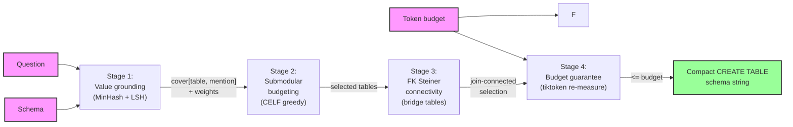
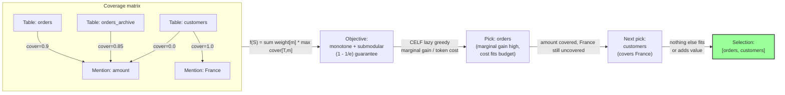
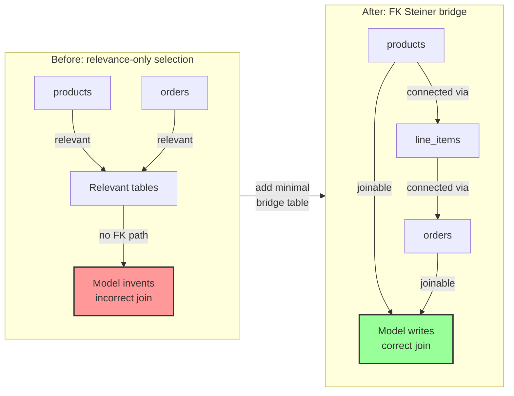

# A Visual Guide to SQLTok

This guide has moved to the site. See the canonical, fully-rendered version with diagrams and math typeset at:

> **[A Visual Guide to SQLTok — Submodular Schema Selection for Text-to-SQL](https://sqltok.dev/posts/visual-guide-to-sqltok/)**

The post covers the full pipeline: value grounding with MinHash and LSH, submodular coverage selection, foreign-key Steiner connectivity, and the hard token-budget guarantee. It also includes benchmark numbers on BIRD mini-dev and the formal `(1 - 1/e)` guarantee with proofs.

For the in-repo implementation, see `sqltok/grounding/` and `sqltok/select/`.

## Diagrams

The diagrams for this guide are written once, as Mermaid source, in [`docs/diagrams/`](../diagrams/) — the single source of truth. The copies below are kept in sync with that source; edit the `.mmd` files, not these blocks.

### Pipeline

```mermaid
flowchart LR
    A["Question"] --> B["Stage 1:\nValue grounding\n(MinHash + LSH)"]
    C["Schema"] --> B
    D["Token budget"] --> F

    B -->|"cover[table, mention]\n+ weights"| E["Stage 2:\nSubmodular\nbudgeting\n(CELF greedy)"]
    E -->|"selected tables"| G["Stage 3:\nFK Steiner\nconnectivity\n(bridge tables)"]
    G -->|"join-connected\nselection"| H["Stage 4:\nBudget guarantee\n(tiktoken re-measure)"]
    D --> H

    H -->|"<= budget"| I["Compact CREATE TABLE\nschema string"]

    style A fill:#f9f,stroke:#333,stroke-width:2px
    style C fill:#f9f,stroke:#333,stroke-width:2px
    style D fill:#f9f,stroke:#333,stroke-width:2px
    style I fill:#9f9,stroke:#333,stroke-width:2px
```

### Grounding

```mermaid
flowchart LR
    Q["Question:\n'total orders for\ncustomers in France'"]
    Q -->|"extract mentions"| M["Mentions:\nFrance, customers,\norders, ..."]
    M -->|"character shingles"| S["Shingles:\n{FRA,RAN,ANC,NCE}, ..."]
    S -->|"MinHash\n64 permutations"| Sig["Signatures:\n[v12, -5, 88, ...]"]
    Sig -->|"banded LSH\n32 bands x 2 rows"| Idx["LSH Index:\ntable names,\ncolumn names,\nsampled values"]
    Idx -->|"query shingles"| Hit["Hits:\n'France' ->\ncustomers.country\nvalue -> customers"]
    Hit -->|"cover matrix\n+ IDF weights"| Out["cover[table, mention]\nweight per mention"]

    style Q fill:#f9f,stroke:#333,stroke-width:2px
    style Out fill:#9f9,stroke:#333,stroke-width:2px
```

### Coverage

```mermaid
flowchart LR
    subgraph Cover["Coverage matrix"]
        direction TB
        T1["Table: orders"]
        T2["Table: orders_archive"]
        T3["Table: customers"]
        M1["Mention: amount"]
        M2["Mention: France"]
        T1 -->|"cover=0.9"| M1
        T2 -->|"cover=0.85"| M1
        T3 -->|"cover=0.0"| M1
        T3 -->|"cover=1.0"| M2
    end

    Cover -->|"f(S) = sum weight[m] * max cover[T,m]"| Obj["Objective:\nmonotone + submodular\n(1 - 1/e) guarantee"]
    Obj -->|"CELF lazy greedy\nmarginal gain / token cost"| Pick["Pick: orders\n(marginal gain high,\ncost fits budget)"]
    Pick -->|"amount covered, France still uncovered"| Next["Next pick:\ncustomers\n(covers France)"]
    Next -->|"nothing else fits\nor adds value"| Done["Selection:\n[orders, customers]"]

    style Done fill:#9f9,stroke:#333,stroke-width:2px
```

### Foreign-key Steiner connectivity

```mermaid
flowchart LR
    subgraph Before["Before: relevance-only selection"]
        P["products"] -->|"relevant"| R1["Relevant tables"]
        O["orders"] -->|"relevant"| R1
        R1 -->|"no FK path"| Prob["Model invents\nincorrect join"]
    end

    subgraph After["After: FK Steiner bridge"]
        P2["products"] -->|"connected via"| L["line_items"]
        L -->|"connected via"| O2["orders"]
        P2 -->|"joinable"| OK["Model writes\ncorrect join"]
        O2 -->|"joinable"| OK
    end

    Before -->|"add minimal\nbridge table"| After

    style OK fill:#9f9,stroke:#333,stroke-width:2px
    style Prob fill:#f99,stroke:#333,stroke-width:2px
```
