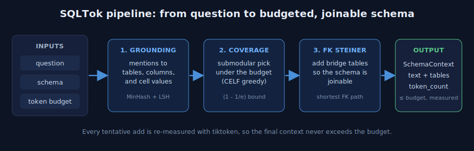
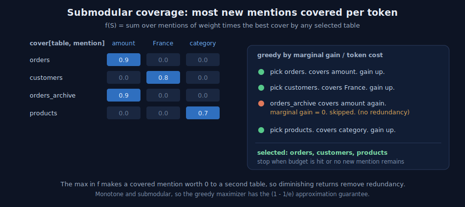

When a language model writes SQL from a question, it needs to see the database schema. The simplest thing to do is paste the whole schema into the prompt. On a real warehouse that is also the most expensive thing to do, and it lowers accuracy, because the model has to find a few relevant tables inside thousands.

This post is a visual, step by step guide to how SQLTok solves that. It selects only the relevant tables and columns, keeps the result inside a token budget, and guarantees that the selected tables can actually be joined. Each idea is grounded in recent Text-to-SQL research, and everything is implemented natively in Python and NumPy. We build intuition first and add the math after.

Measured up front: across all 500 BIRD mini-dev questions, at a 2000-token budget SQLTok keeps every table the gold query needs on 97 percent of questions while cutting total prompt input by 17 percent. At a 1000-token budget it cuts total input by 36 percent at 92 percent full table recall. The numbers are deterministic and need no model.

## The whole idea in one picture

SQLTok is a pipeline with three working stages and a guarantee.

{fig-alt="SQLTok pipeline"}

The inputs are a question, a schema, and a token budget. Stage one decides which words in the question touch which tables. Stage two selects a set of tables that covers the most of the question per token, under the budget. Stage three repairs the selection so the tables can be joined. The output is a compact schema string whose token count is measured, not estimated, so it never exceeds the budget.

## Stage one: grounding, or which words touch which tables

Start with the failure mode of plain keyword search. Consider the question "total orders for customers in France." The word that matters most, "France," is not a table name and not a column name. It is a value sitting inside `customers.country`. Keyword search over schema names cannot see it.

SQLTok grounds mentions against the schema names and against sampled cell values.

{fig-alt="Value grounding with MinHash and LSH"}

Read the figure left to right. The mention "France" becomes a set of three-character pieces, called shingles: `{fra, ran, anc, nce}`. Shingles give fuzzy matching, so plurals, casing, and small typos still line up. Each shingle set is compressed into a short numeric signature with MinHash, and the signature is looked up in a banded LSH index that holds every table name, column name, and sampled value. "France" collides with the sampled values of `customers.country`, so it grounds to `customers`, even though no name mentions it.

### The math behind grounding

Jaccard similarity measures the overlap of two sets:

$$
\mathrm{Jaccard}(A, B) = \frac{\lvert A \cap B \rvert}{\lvert A \cup B \rvert}.
$$

MinHash estimates that overlap cheaply. For a random hash permutation $h$, the probability that two sets share the same minimum equals their Jaccard similarity:

$$
\Pr\!\left[\min_{a \in A} h(a) = \min_{b \in B} h(b)\right] = \mathrm{Jaccard}(A, B).
$$

With $k = 64$ independent permutations, the fraction of matching signature positions is an unbiased estimate of Jaccard, computed by comparing 64 integers instead of two raw sets.

LSH turns that estimate into fast lookup. The signature is split into $b$ bands of $r$ rows. Two items become candidates if they match on at least one full band, so the probability that two items of similarity $s$ collide is

$$
\Pr[\text{collide}] = 1 - \left(1 - s^{\,r}\right)^{b},
$$

an S-shaped curve with a soft threshold near $(1/b)^{1/r}$. SQLTok uses $b = 32$ bands of $r = 2$ rows, a threshold near $0.18$, which favors recall.

Each grounded mention gets a weight from an inverse document frequency computed on the schema itself:

$$
w(m) = \log\!\left(1 + \frac{\lvert T \rvert}{\mathrm{df}(m)}\right),
$$

where $\mathrm{df}(m)$ is the number of tables the mention touches. A mention that hits every table, like `id`, gets near zero weight. A mention that hits a single table is highly discriminative. The signal comes from your database, not a generic corpus.

The output of stage one is a matrix $\mathrm{cover}[T, m] \in [0,1]$ and a weight per mention.

## Stage two: coverage, or pick the best tables per token

Now we choose tables. The objective is weighted maximum coverage: each mention scores through the single best table that covers it.

{fig-alt="Submodular coverage selection"}

The figure shows why this is the right shape. Once "amount" is covered by `orders`, a second table that also covers "amount," such as `orders_archive`, adds nothing. Its marginal gain is zero, so it is skipped. Redundancy is removed automatically, not by a special rule.

### The math behind coverage

The objective is

$$
f(S) = \sum_{m \in M} w(m)\, \max_{T \in S}\, \mathrm{cover}(m, T).
$$

This function is monotone, adding a table never lowers it, and submodular, the gain of a table shrinks as the selection grows. For monotone submodular functions a greedy maximizer reaches at least a $(1 - 1/e) \approx 0.63$ fraction of the optimum:

$$
f(S_{\text{greedy}}) \ge \left(1 - \tfrac{1}{e}\right) f(S^{\*}).
$$

That is a guarantee, not a hope.

Tables have different token costs, so selection is a knapsack. SQLTok picks the table with the largest ratio of marginal gain to token cost,

$$
T^{\*} = \arg\max_{T \notin S}\; \frac{f(S \cup \{T\}) - f(S)}{c(T)},
$$

commits it only if the re-measured context still fits the budget, and uses CELF lazy evaluation to avoid recomputing every candidate at every step. Because gains only shrink, a candidate at the top of the queue with a current timestamp is provably the best next pick. SQLTok also compares against the best single table that fits, which restores the constant-factor guarantee for the budgeted case.

## Stage three: foreign-key Steiner connectivity

A set chosen purely for relevance can contain two tables with no join between them. The model then invents a join and produces wrong SQL.

{fig-alt="Foreign-key Steiner bridge"}

SQLTok builds the foreign-key graph, checks whether the selected tables are connected, and if not adds the smallest set of bridge tables along the shortest foreign-key path, as long as they fit the budget. On the left, `products` and `orders` are both relevant but unlinked. On the right, `line_items` is added as a bridge, and now the schema is joinable. This follows the observation that foreign keys are the natural bridges between relevant tables.

## Stage four: the budget is a hard ceiling

Every time a table is considered, SQLTok renders the full context and counts it with the real tokenizer, committing the table only if the total stays within budget, and dropping the sample row before dropping the table. Because the actual string is measured at each step, the final token count at or below the budget is an invariant that no selection logic can break.

## Does it work

On all 500 BIRD mini-dev questions across 11 databases, measured with `tiktoken`. Full-recall is the rate at which every gold-query table survives selection, the ceiling on achievable accuracy.

| budget | full-recall | table recall | total input tokens | total input reduction |
| ---: | ---: | ---: | ---: | ---: |
| baseline | 100% | 100% | 629,819 | reference |
| 1000 | 91.8% | 96.3% | 401,285 | 36.3% |
| 2000 | 97.4% | 99.0% | 521,760 | 17.2% |
| 4000 | 97.4% | 99.0% | 581,559 | 7.7% |

These token figures are deterministic. The remaining question, whether accuracy holds at the lower token count, is answered by running the official BIRD execution-accuracy script with a real model, which the repository supports directly.

## Try it

```bash
pip install sqltok
```

```python
from sqltok import SchemaBudgetManager

mgr = SchemaBudgetManager.from_sqlite("db.sqlite")
ctx = mgr.build_context("total orders for customers in France", token_budget=2000)
print(ctx.text, ctx.tables, ctx.token_count)
```

## References

1. Datalake Agent, Agentic NL2SQL to Reduce Computational Costs. [arXiv:2510.14808](https://arxiv.org/abs/2510.14808).
2. Bidirectional Schema Linking, Findings of EACL 2026. [arXiv:2510.14296](https://arxiv.org/abs/2510.14296).
3. AutoLink, Autonomous Schema Exploration and Expansion at Scale. [arXiv:2511.17190](https://arxiv.org/abs/2511.17190).
4. AdaGReS, Adaptive Greedy Context Selection for Token-Budgeted RAG. [arXiv:2512.25052](https://arxiv.org/abs/2512.25052).
5. Sub-SA, Submodular Selective Annotation. [arXiv:2407.05693](https://arxiv.org/abs/2407.05693).
6. CHESS, Contextual Harnessing for Efficient SQL Synthesis. [arXiv:2405.16755](https://arxiv.org/abs/2405.16755).
7. Nemhauser, Wolsey, and Fisher, the $(1 - 1/e)$ bound for submodular maximization, 1978. Broder, MinHash, 1997. Indyk and Motwani, LSH, 1998. Leskovec et al., CELF, 2007.
